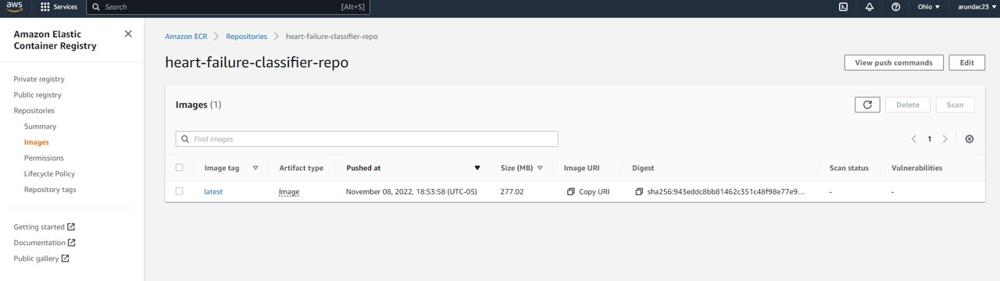
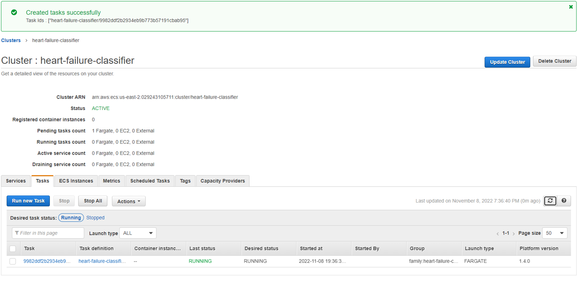
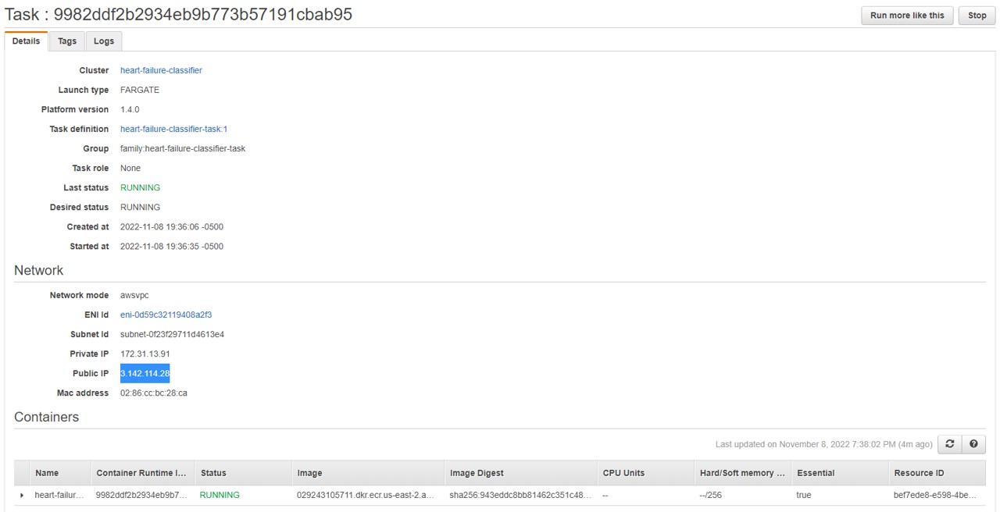
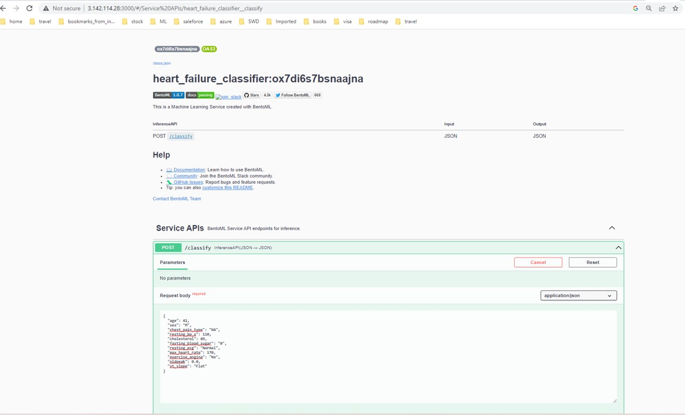

# Heart Failure Prediction
`The goal is to predict heart failure rate of the patients based the available features.` 

`Original data location:` [Heart failure data](https://www.openml.org/search?type=data&status=active&id=43682)

This is a midterm project as part of ML-Zoomcamp 2022 organized by [Alexey grigorev](https://github.com/alexeygrigorev). The original repositary of this course is in this link [mlzoomcamp](https://github.com/alexeygrigorev/mlbookcamp-code/tree/master/course-zoomcamp)

## Description about dataset:
Context Heart Disease Dataset (Most comprehensive) Content Heart disease is also known as Cardiovascular diseases (CVDs) are the number 1 cause of death globally, taking an estimated 17.9 million lives each year which is about 32 of all deaths globally. CVDs are a group of disorders of the heart and blood vessels and include coronary heart disease, cerebrovascular disease, rheumatic heart disease, and other conditions. Four out of 5CVD deaths are due to heart attacks and strokes, and one-third of these deaths occur prematurely in people under 70 years of age. We have curated this dataset by combining different datasets already available independently but not combined before. W have combined them over 11 common features which makes it the largest heart disease dataset available for research purposes. The five datasets used for its curation are: Database: of instances:

Cleveland: 303 Hungarian: 294 Switzerland: 123 Long Beach VA: 200 Stalog (Heart) Data Set: 270

Total 1190 Acknowledgements The dataset is taken from three other research datasets used in different research papers. The Nature article listing heart disease database and names of popular datasets used in various heart disease research is shared below. https://www.nature.com/articles/s41597-019-0206-3 Inspiration Can you find interesting insight from the largest heart disease dataset available so far and build predictive model which can assist medical practitioners in detecting early-stage heart disease

### Attribute Information

| Variable | Description | Metrics   |
:---        |    :----:   |            ---:|
| Age | age of the patient | years |
| Sex | sex of the patient | M = Male,F = Female |
| ChestPainType | TA = Typical Angina, ATA = Atypical Angina, NAP = Non-Anginal Pain, ASY = Asymptomatic | NA |
| RestingBP | resting blood pressure | mm Hg |
| Cholesterol | serum cholesterol | mm/dl |
| FastingBS | fasting blood sugar	`1 = if FastingBS > 120 mg/dl`, `0 = otherwise` | mg/dl |
|RestingECG | resting electrocardiogram results	Normal = Normal, ST = having ST-T wave abnormality (T wave inversions and/or ST elevation or depression of > 0.05 mV), LVH = showing probable or definite left ventricular hypertrophy by Estes' criteria|NA|
|MaxHR|	maximum heart rate achieved	Numeric value between 60 and 202
|ExerciseAngina|	exercise-induced angina	Y = Yes, N = No|NA|
|Oldpeak|	Oldpeak = ST	Numeric value measured in depression|NA|
|ST_Slope|	the slope of the peak exercise ST segment	Up = upsloping, Flat = flat, Down = downsloping|NA|

### Target variable

### `HeartDisease`	output class : 1 = heart disease, 0 = Normal

## Project Description

For this midterm project, a binary classification model was trained on the `heart.csv` dataset in order to predict the `HeartDisease` feature.

`5` models were trained which includes logistic regression, Decision Tree, Random Forest, Extra tress and a Gradient Boosting model.Evaluation metrics AUC score is considered as main criteria to choose the best performing model. Finally, Extra trees model was selected for the deployment based on its performance. 

The exploratory data analysis, Model building , parameter tuning and final model selection was done using Jupyter Notebook --> `notebook.ipynb`.

The model training script was exported as `train.ipynb`.

# Files

* `README.md`: Project description markdown file.
* `heart.csv`: the CSV file containing the dataset.
* `notebook.ipynb`: a Jupyter Notebook for model building and parameter tuning
* `train.ipynb`: Trained model file to export bentoml model with name tag.
* `service.py`:  File that used to call for the BentoML service.
* `bentofile.yaml`: file that used to build bentoml to get all the dependencies and creates one single deployable directory for us.
* `ox7di6s7bsnaajna`: Single deployble directory that includes bentoml model, software dependency and requirements information, docker file, service file

## Model build, containerization and deployment:
#### Creation of new virtual conda environment:
`prerequisite: Download and install miniconda`
you use this following comment for miniconda installation in your WSL.
##### `curl https://repo.anaconda.com/miniconda/Miniconda3-latest-Linux-x86_64.sh --output miniconda_installer.sh`
##### `bash miniconda_installer.sh`

Go to Ubuntu bash shell or WSl2,And run the following code to create an environment called midtermproj

##### `conda create -n midtermproj jupyter numpy pandas matplotlib seaborn scikit-learn` --> This will create a new env and install all required softwares

##### `conda activate midtermproj` --> to activate the env

##### `pip install bentoml pydantic` --> install bentoml and pydantic only using pip.

#### Training and saving the bentoml model:

Trained model is saved as `train.ipynb` file. Inorder to save a bentoml model. open a jupyter notebook in a same environment

##### `jupyter notebook` --> To open a juypter notebook.

Then open and execute `train.ipynb` using the jupyter notebook.

This will create a new bentoml model with name tag.

Once the model is saved, use the already created `service.py`file to run the app using the code

##### `bentoml serve service:svc` -->  service refers to script and svc is the service name.

This will open swagger UI through this port url 127.0.0.1:3000 or 0.0.0.0:3000. You can check your prediction here by inputting your feature variable. I will cover the details of it later.

#### lets click ctrl+c to come out of this service.

Before build the bentoml, we need to create a bentoml.yaml by specifing the following details.
 
`service: "service.py:svc"` --> the service and endpoint to run the app

labels: --> Details about the owner and title of the project

  `owner: arundac23`
  
  `project: heart-failure-pred`
  
include: --> Files that need to be included in that build

`- "*.py"`

python: --> required softwares list to execute the project.

  packages:
  
    `- scikit-learn==1.1.1
    
    - pydantic
    
    - pandas
    
    - numpy`
    
 Now we are ready for build, run this following command from the folder where bentofile.yaml is saved.
 
 ##### `bentoml build`
 
 successful build will show the bentoml logo and model tag information.
 
 After the build, go to this following directory
 
 Single deployble directory that includes bentoml model, software dependency and requirements information, docker file, service file

 ##### `cd /bentoml/bentos/heart_failure_classifier/ox7di6s7bsnaajna(your_latest_build)`
 
 type `tree` to see the tree view of all the files. use `sudo apt install tree` if tree is not installed in your system
 
 

if you notice, bentoml build automatically create a docker file for us along with model,service and software requirements files. 

Now we are ready to containerize and create a docker image for our model.Execute following code for docker image creation.

Please make sure docker is installed and running in your system before this process

##### `bentoml containerize heart_failure_classifier:ox7di6s7bsnaajna ` --> heart_failure_classifier:ox7di6s7bsnaajna is tag of last deployable bentoml build.

you can also use this comment

##### `bentoml containerize heart_failure_classifier:latest `

This will create a docker image. 

I have uploaded this docker image into docker hub. You can download into your own machine to run it without doing the above procedure.

Run the following command to download the docker image into your system

##### `docker pull arundac23/heart_failure_classifier:mlzoomcamp2022`

Run the following command with docker to make the predictions using swagger UI. 

##### `docker run -it --rm -p 3000:3000 heart_failure_classifier:ox7di6s7bsnaajna`

 You can open swagger UI using this url 127.0.0.1:3000 or http://localhost:3000.
 Your swagger UI should be like this
 
 
 #### Under ServiceAPIs --> Click `POST` down arrow at right corner
 
 
 ##### then click, `Try it out` at top right corner
 
 
 Copy and paste the below code in the Request body and click execute:
 `{
  "age": 41,
  "sex": "M",
  "chest_pain_type": "ASY",
  "resting_bp_s": 110,
  "cholesterol": 289,
  "fasting_blood_sugar": "0",
  "resting_ecg": "Normal",
  "max_heart_rate": 170,
  "exercise_angina": "No",
  "oldpeak": 0.0,
  "st_slope": "Flat"
}`

you should get successful response as below based on your input.

## AWS Deployment:
Model was deployed in AWS. But service was turned off after that. I will attach my images of my AWS deployement.

Docker image is uploaded to amazon elastic container registry

Custer and tasks created in Amazon container service

Running the task in AWS service

Prediction using Final Deployed model in AWS cloud.

 

